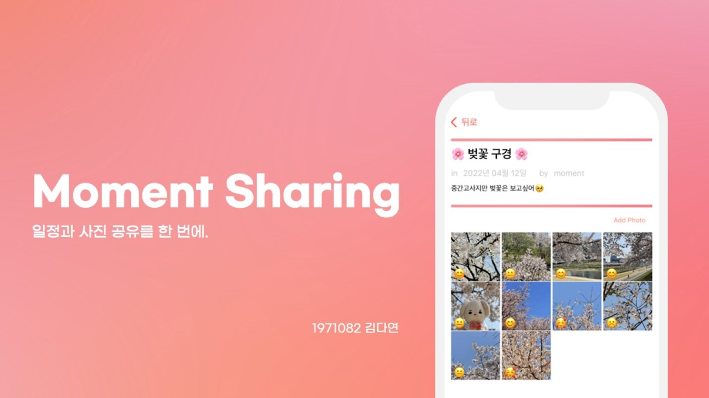
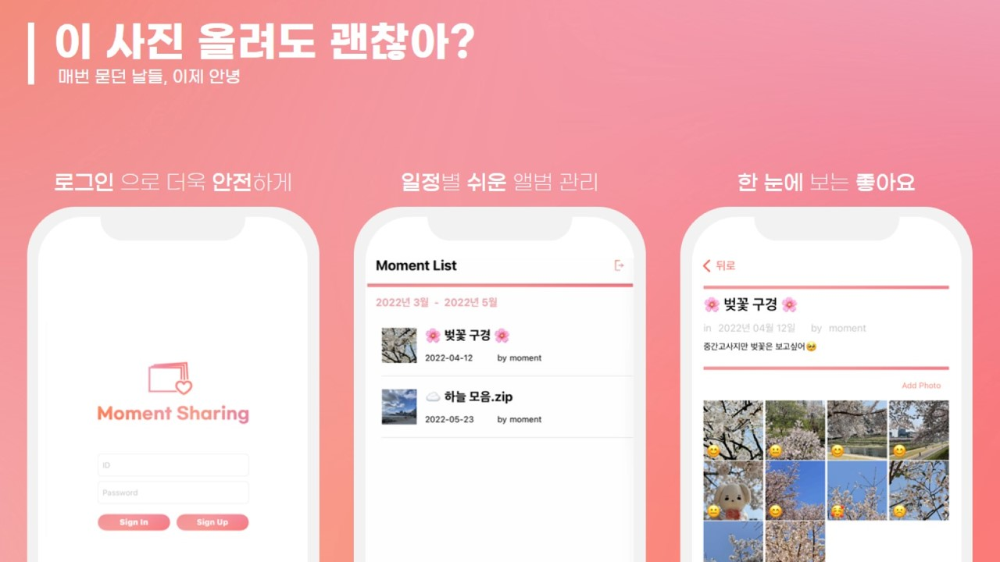
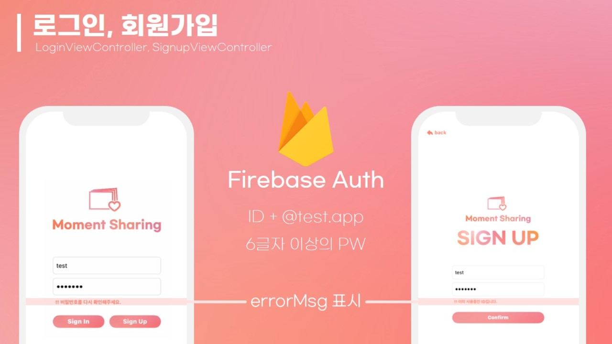
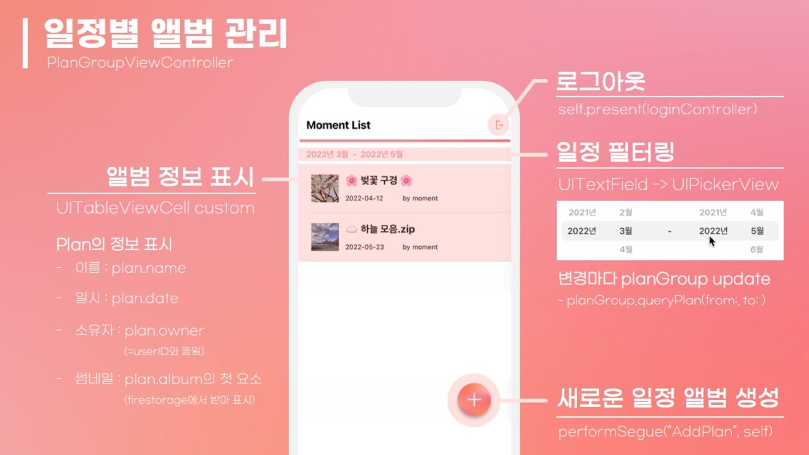
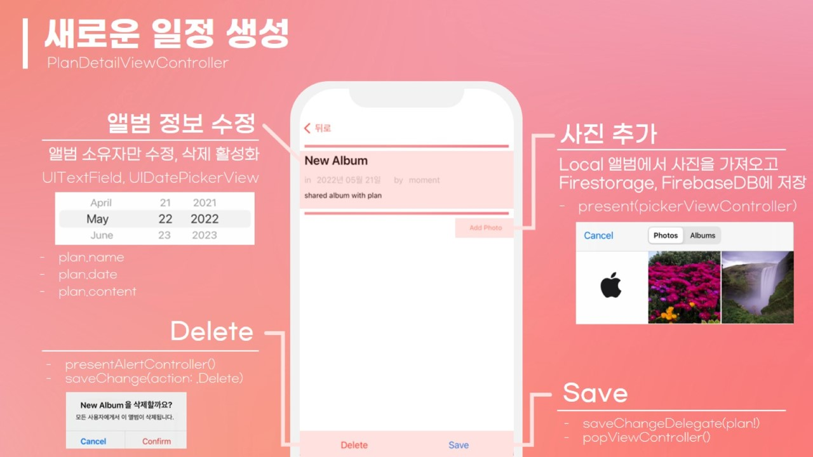
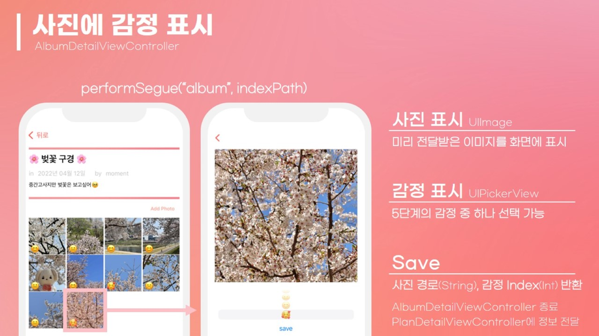

# 일정과 사진 공유를 한번에, Moment Sharing
from. 2022-1 iOS Term project


---
<br/>

## 📌 작품 소개

```
💡 MomentSharing은 각 일정마다 앨범을 생성하고,
사진 업로드 및 해당 사진에 대한 감정을 공유하는 iOS 어플리케이션입니다.
```

<br/>
<br/>

---

<br/>

## ⚙️ 시스템 구조


<br/>
<br/>

---

<br/>

## 🔧 적용 기술

### 개발 환경

- macOS Monterey (v 12.1)

### 개발 도구

- XCode

### 개발 언어

- Swift

### 핵심 기술

- Swift, Firebase Auth, Firebase DB, Firebase Storage

<br/>
<br/>

---

<br/>

## 🖼 프로젝트 결과







